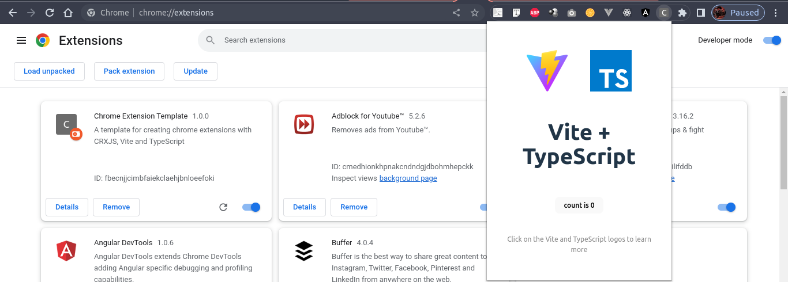
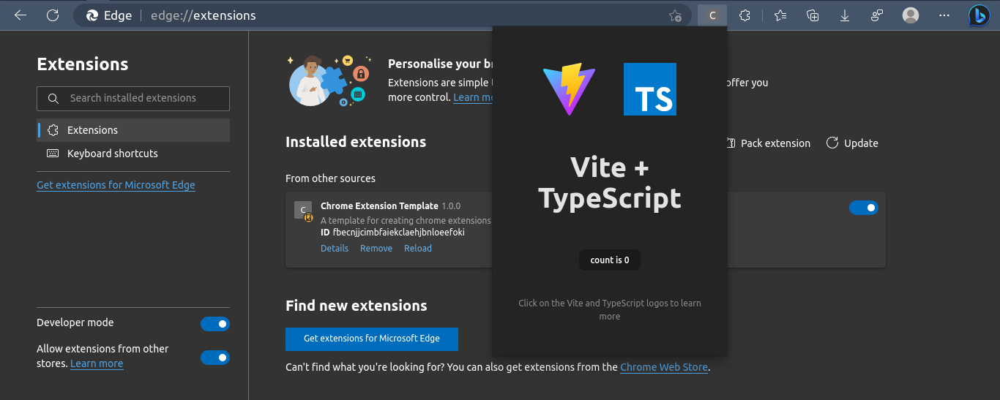
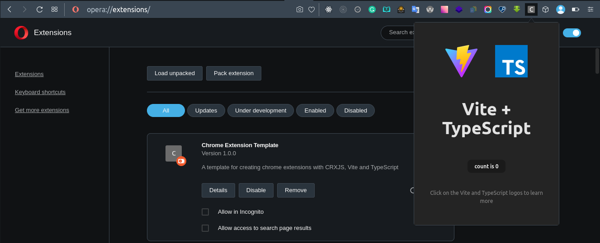

<h1 align="center">Chrome Extension Template</h1>
<p align="center">With CRXJS, Vite, and TypeScript </p>

<h2>Introduction</h2>

This is a template for creating Chrome extensions with CRXJS, Vite, and TypeScript.
How does it work? It's simple. Just run the following command:

```sh
  yarn build
```

This will build the extension and place it in the `dist` folder.

To test your extension, you'll need to enable developer mode in Chrome. To do this, go to `chrome://extensions` and enable developer mode. Then, click on `Load unpacked` and select the `dist` folder. Your extension should now be loaded.

This should also work on any Chromium-based browser.

> As long as the browser is Chromium-based, the url `chrome://extensions` should work. If it doesn't, try `edge://extensions` or `opera://extensions` or `brave://extensions`.

This extension was tested on Chrome (Version 111.0.5563.64), Brave (Version 1.49.120), Edge (Version 111.0.1661.41), and Opera (Version 96.0.4693.80).

There are screenshots attached below showing the loaded extension for different Chromium-based browsers .

<h2>Folder & File Structure</h2>

```sh
~/chrome-extension on main
❯ tree --filelimit 10
  ├── index.html
  ├── manifest.json
  ├── node_modules [68 entries exceeds filelimit, not opening dir]
  ├── package.json
  ├── public
  │   └── vite.svg
  ├── src
  │   ├── counter.ts
  │   ├── main.ts
  │   ├── style.css
  │   ├── typescript.svg
  │   └── vite-env.d.ts
  ├── tsconfig.json
  ├── vite.config.js
  └── yarn.lock
```

- `index.html`: The HTML file that will be injected into the extension's popup.
- `manifest.json`: The manifest file that describes the extension.
- `node_modules`: The folder that contains all the dependencies.
- `package.json`: The file that contains all the dependencies.
- `public`: The folder that contains all the static assets.
- `src`: The folder that contains all the source code.
- `tsconfig.json`: The TypeScript configuration file.
- `vite.config.js`: The Vite configuration file.
- `yarn.lock`: The file that contains all the dependencies' versions.

<h2>Screenshots</h2>

<h3>Brave Browser</h3>


<h3>Chrome Browser</h3>



<h3>Edge Browser</h3>
  
  

<h3>Opera Browser</h3>



<h2>License</h2>

[MIT License](./LICENSE)

<h2>Creator</h2>

Emmanuel C. Jemeni

- Twitter: [@Jemeni11\_](https://www.twitter.com/Jemeni11_)
- LinkedIn: [Emmanuel Jemeni](https://www.linkedin.com/in/emmanuel-jemeni)
